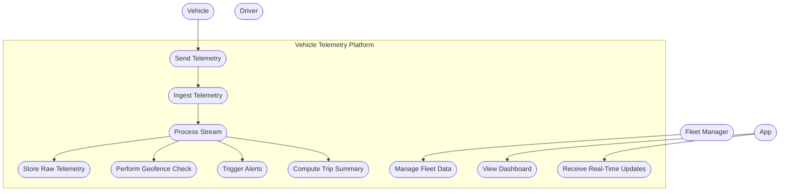

```mermaid
flowchart TB

    %% Actors
    V([Vehicle])
    FM([Fleet Manager])
    D([Driver])
    APP([App])

    %% System Boundary
    subgraph VTP[Vehicle Telemetry Platform]
        UC1([Send Telemetry])
        UC2([Ingest Telemetry])
        UC3([Process Stream])
        UC4([Store Raw Telemetry])
        UC5([Perform Geofence Check])
        UC6([Trigger Alerts])
        UC7([Compute Trip Summary])
        UC8([Manage Fleet Data])
        UC9([View Dashboard])
        UC10([Receive Real-Time Updates])
    end

    %% Interactions
    V --> UC1
    UC1 --> UC2
    UC2 --> UC3
    UC3 --> UC4
    UC3 --> UC5
    UC3 --> UC6
    UC3 --> UC7

    FM --> UC8
    APP --> UC9
    APP --> UC10
```
