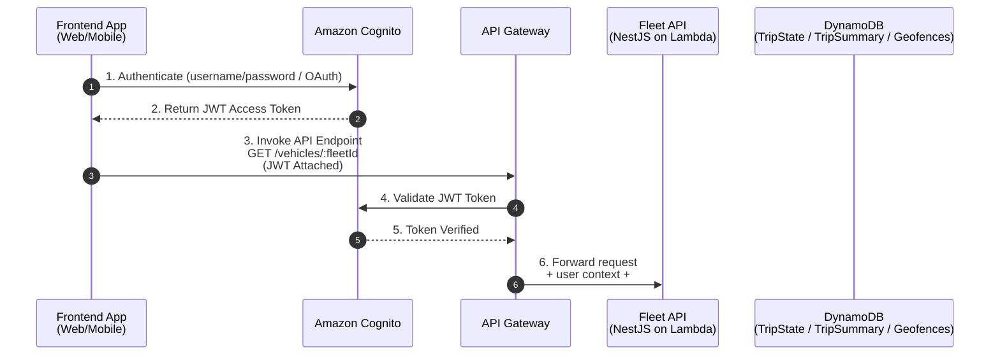

```mermaid
flowchart TB

    %% Actors
    V([Vehicle])
    FM([Fleet Manager])
    D([Driver])
    APP([App])

    %% System Boundary
    subgraph VTP[Vehicle Telemetry Platform]
        UC1([Send Telemetry])
        UC2([Ingest Telemetry])
        UC3([Process Stream])
        UC4([Store Raw Telemetry])
        UC5([Perform Geofence Check])
        UC6([Trigger Alerts])
        UC7([Compute Trip Summary])
        UC8([Manage Fleet Data])
        UC9([View Dashboard])
        UC10([Receive Real-Time Updates])
    end

    %% Interactions
    V --> UC1
    UC1 --> UC2
    UC2 --> UC3
    UC3 --> UC4
    UC3 --> UC5
    UC3 --> UC6
    UC3 --> UC7

    FM --> UC8
    APP --> UC9
    APP --> UC10
```

```mermaid
sequenceDiagram
    autonumber

    participant Client as Frontend App<br/>(Web/Mobile)
    participant Cognito as Amazon Cognito
    participant APIGW as API Gateway
    participant Lambda as Fleet API<br/>(NestJS on Lambda)
    participant Dynamo as DynamoDB<br/>(TripState / TripSummary / Geofences)

    Client->>Cognito: 1. Authenticate (username/password / OAuth)
    Cognito-->>Client: 2. Return JWT Access Token

    Client->>APIGW: 3. Invoke API Endpoint<br/>GET /vehicles/:fleetId<br/>(JWT Attached)
    APIGW->>Cognito: 4. Validate JWT Token
    Cognito-->>APIGW: 5. Token Verified

    APIGW->>Lambda: 6. Forward request<br/>+ user context +
```

```mermaid
flowchart TB

    %% ========== GLOBAL SERVICES ==========
    subgraph Global_Services [Global Services]
        DNS[Route53 Global DNS and Failover]
        Cognito[Amazon Cognito User Identity]
    end

    %% ========== PRIMARY REGION ==========
    subgraph Region1 [Region us-east-1 Primary]

        %% ---- Tenant A ----
        subgraph TenantA [Tenant Acme Corp]
            VehicleA[Vehicle Devices]
            APIGW_A[API Gateway]
            Ingest_A[Lambda Ingest]
            Kinesis_A[Kinesis Data Stream]
            Consumer_A[Lambda Kinesis Consumer]

            TripStateA[DynamoDB TripState]
            FirehoseA[Kinesis Firehose]
            S3RawA[S3 Bucket Raw Telemetry]
            GeoAPI_A[Amazon Location Geofence]
            AlertsA[SNS and DynamoDB Alerts Engine]
            StepFnA[Step Functions Trip Workflow]
            TripSummaryA[DynamoDB and S3 Trip Summary]

            FleetAPI_A[NestJS Lambda Fleet API]
            WebMobile_A[Web and Mobile Apps Cognito WebSocket]

            %% Flows
            VehicleA --> DNS --> APIGW_A
            APIGW_A --> Ingest_A
            Ingest_A --> Kinesis_A
            Kinesis_A --> Consumer_A
            Consumer_A --> TripStateA
            Consumer_A --> FirehoseA --> S3RawA
            Consumer_A --> GeoAPI_A
            Consumer_A --> AlertsA
            Consumer_A --> StepFnA --> TripSummaryA

            WebMobile_A --> FleetAPI_A
            FleetAPI_A --> TripStateA
            FleetAPI_A --> TripSummaryA
            FleetAPI_A --> AlertsA
        end

        %% ---- Tenant B ----
        subgraph TenantB [Tenant Contoso]
            VehicleB[Vehicle Devices]
            APIGW_B[API Gateway]
            Ingest_B[Lambda Ingest]
            Kinesis_B[Kinesis Data Stream]
            Consumer_B[Lambda Kinesis Consumer]

            TripStateB[DynamoDB TripState]
            FirehoseB[Kinesis Firehose]
            S3RawB[S3 Bucket Raw Telemetry]
            GeoAPI_B[Amazon Location Geofence]
            AlertsB[SNS and DynamoDB Alerts Engine]
            StepFnB[Step Functions Trip Workflow]
            TripSummaryB[DynamoDB and S3 Trip Summary]

            FleetAPI_B[NestJS Lambda Fleet API]
            WebMobile_B[Web and Mobile Apps Cognito WebSocket]

            VehicleB --> DNS --> APIGW_B
            APIGW_B --> Ingest_B
            Ingest_B --> Kinesis_B
            Kinesis_B --> Consumer_B
            Consumer_B --> TripStateB
            Consumer_B --> FirehoseB --> S3RawB
            Consumer_B --> GeoAPI_B
            Consumer_B --> AlertsB
            Consumer_B --> StepFnB --> TripSummaryB

            WebMobile_B --> FleetAPI_B
            FleetAPI_B --> TripStateB
            FleetAPI_B --> TripSummaryB
            FleetAPI_B --> AlertsB
        end
    end

    %% ========== SECONDARY REGION ==========
    subgraph Region2 [Region eu-west-1 DR]
        Kinesis_REPL[Kinesis Replicated Stream]
        S3RawA_CR[S3 Raw Telemetry Replica]
        DynamoDB_Global[DynamoDB Global Table Replica]
    end

    %% Cross region links
    S3RawA -.-> S3RawA_CR
    Kinesis_A -.-> Kinesis_REPL
    TripStateA -.-> DynamoDB_Global

```
