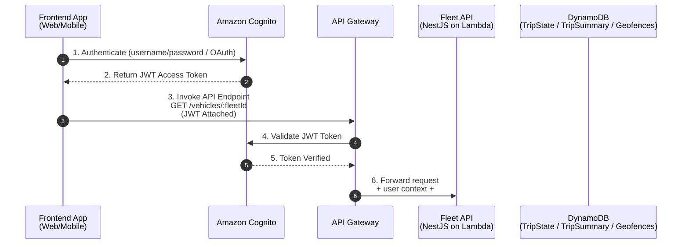

```mermaid
flowchart TB
    %% Corporate styling
    classDef awsNode fill:#f8fafc,stroke:#1f2937,stroke-width:1px,rx:6,ry:6,font-size:12px;
    classDef dataNode fill:#eef2ff,stroke:#3730a3,stroke-width:1px,rx:6,ry:6,font-size:12px;
    classDef procNode fill:#ecfccb,stroke:#15803d,stroke-width:1px,rx:6,ry:6,font-size:12px;
    classDef extActor fill:#fff7ed,stroke:#92400e,stroke-width:1px,rx:6,ry:6,font-size:12px;
    classDef callout fill:#ffffff,stroke:#111827,stroke-dasharray:4 2,rx:6,ry:6;

    %% Global services
    subgraph Global["🌍 Global Services"]
      direction TB
      DNS[Route53\n(Global DNS & Failover)]:::awsNode
      Cognito[Amazon Cognito\n(User Pools & Identity)]:::awsNode
    end

    %% PRIMARY REGION
    subgraph Region1["🏷️ Region: us-east-1 (Primary)"]
      direction TB

      %% Tenant A block (example of per-tenant isolation)
      subgraph TenantA["Tenant: Acme Corp (Isolated Env)"]
        direction TB
        VehicleA[Vehicle Devices\n(OBD/Telematics)]:::extActor
        APIGW_A[API Gateway (Regional/Edge)]:::awsNode
        Ingest_A[Lambda — Ingest]:::procNode
        Kinesis_A[(Kinesis Data Stream)]:::dataNode
        Consumer_A[Lambda — Kinesis Consumer]:::procNode

        TripStateA[(DynamoDB: TripState)]:::dataNode
        FirehoseA[Kinesis Firehose]:::awsNode
        S3RawA[(S3: raw-telemetry-acme)]:::dataNode
        GeoAPI_A[Amazon Location\n(Geofencing)]:::awsNode
        AlertsA[Alerts Engine\nSNS + DynamoDB]:::awsNode
        StepFnA[Step Functions\nTrip Orchestration]:::awsNode
        TripSummaryA[(DynamoDB + S3: TripSummary)]:::dataNode

        FleetAPI_A[Lambda: Fleet Mgmt (NestJS)]:::procNode
        WebMobile_A[Web & Mobile Clients\n(Cognito + WebSocket)]:::extActor

        %% flows
        VehicleA -->|HTTPS / MQTT| DNS --> APIGW_A
        APIGW_A --> Ingest_A
        Ingest_A --> Kinesis_A
        Kinesis_A --> Consumer_A
        Consumer_A --> TripStateA
        Consumer_A --> FirehoseA --> S3RawA
        Consumer_A --> GeoAPI_A
        Consumer_A --> AlertsA
        Consumer_A --> StepFnA --> TripSummaryA
        WebMobile_A -->|REST / WS| FleetAPI_A
        FleetAPI_A --> TripStateA
        FleetAPI_A --> TripSummaryA
        FleetAPI_A -->|Publish| AlertsA
      end

      %% Tenant B (example)
      subgraph TenantB["Tenant: Contoso (Isolated Env)"]
        direction TB
        VehicleB[Vehicle Devices]:::extActor
        APIGW_B[API Gateway]:::awsNode
        Ingest_B[Lambda — Ingest]:::procNode
        Kinesis_B[(Kinesis Data Stream)]:::dataNode
        Consumer_B[Lambda Consumer]:::procNode

        TripStateB[(DynamoDB: TripState)]:::dataNode
        FirehoseB[Kinesis Firehose]:::awsNode
        S3RawB[(S3: raw-telemetry-contoso)]:::dataNode
        GeoAPI_B[Amazon Location]:::awsNode
        AlertsB[SNS + DynamoDB]:::awsNode
        StepFnB[Step Functions]:::awsNode
        TripSummaryB[(DynamoDB + S3)]:::dataNode

        FleetAPI_B[Lambda: Fleet Mgmt]:::procNode
        WebMobile_B[Web & Mobile Clients]:::extActor

        VehicleB -->|HTTPS / MQTT| DNS --> APIGW_B
        APIGW_B --> Ingest_B
        Ingest_B --> Kinesis_B
        Kinesis_B --> Consumer_B
        Consumer_B --> TripStateB
        Consumer_B --> FirehoseB --> S3RawB
        Consumer_B --> GeoAPI_B
        Consumer_B --> AlertsB
        Consumer_B --> StepFnB --> TripSummaryB
        WebMobile_B -->|REST / WS| FleetAPI_B
        FleetAPI_B --> TripStateB
        FleetAPI_B --> TripSummaryB
      end
    end

    %% DR / Secondary Region
    subgraph Region2["🏷️ Region: eu-west-1 (DR / Active-Active)"]
      direction TB
      Kinesis_REPL[(Kinesis Replicated Stream)]:::dataNode
      S3RawA_CR[(S3: raw-telemetry-acme (replica))]:::dataNode
      DynamoDB_Global[(DynamoDB Global Table Replica)]:::dataNode
    end

    %% Global links (replication & routing)
    DNS --> APIGW_A
    DNS --> APIGW_B
    S3RawA -.->|S3 CRR| S3RawA_CR
    Kinesis_A -.->|Cross-Region Replication| Kinesis_REPL
    TripStateA -.->|DynamoDB Global Tables| DynamoDB_Global

    %% Security callout
    Security[Security Controls:\n- VPC Endpoints (S3/Kinesis/DynamoDB)\n- IAM & Resource Policies\n- Cognito + JWT tenant claims\n- KMS (SSE-KMS) encryption\n- WAF & Shield]:::callout
    Region1 --> Security
    Region2 --> Security

    note right of Region2
      * Tenant isolation via separate resources or strict partitioning\n
      * Cross-region replication for durability and DR\n
      * Capacity planning: Kinesis shards, Lambda concurrency, DynamoDB capacity
    end
```
